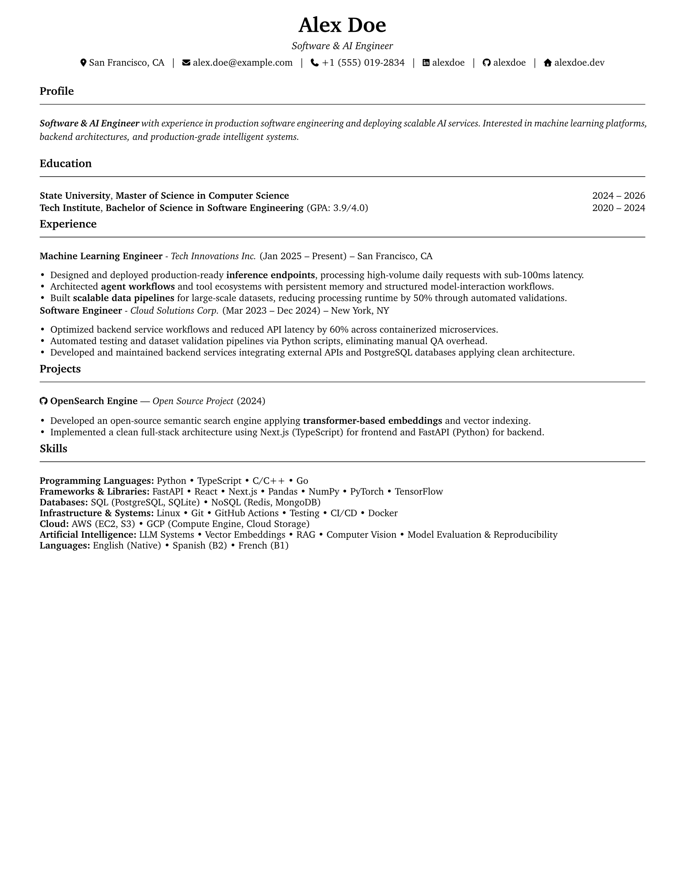

# Career Verification Tool & Application Repository

Centralized repository template and verification framework for managing canonical CVs, multilingual profiles, and job-specific application branches using **Typst**.

---

## Output CV Preview



---

## Repository Structure

```text
.
├── Makefile                           # Automated build, application, and verification commands
├── pyproject.toml                     # Python verification dependencies & tools (managed via uv)
├── README.md                          # Repository guide and workflow documentation
├── verification/                      # Extracted ATS verification reports (LLM-ready)
│   ├── cv_en_verification.md          # Multi-engine English CV extraction report
│   └── cv_fr_verification.md          # Multi-engine French CV extraction report
├── src/
│   └── cv_verifier/                   # Modular Python PDF extraction & ATS audit package
│       ├── extractors/                # PyMuPDF, pdfplumber, pypdf, pdfminer.six, Unstructured
│       ├── ats_analyzer.py            # ATS heuristics (contact info, sections, ligatures, flow)
│       ├── reporter.py                # LLM markdown scorecard generator
│       └── cli.py                     # CLI tool (`cv-verify`)
├── tests/                             # Pytest suite validating all extractors & analyzers
├── templates/
│   ├── cv.typ                         # Shared ATS-compliant CV layout & components
│   └── cover-letter.typ               # Shared 1-page Cover Letter layout
├── cv/
│   ├── en/
│   │   ├── content.typ                # Canonical English profile content
│   │   ├── cv.typ                     # English Typst entrypoint
│   │   └── cv.pdf                     # Compiled English CV PDF
│   └── fr/
│       ├── content.typ                # Canonical French profile content
│       ├── cv.typ                     # French Typst entrypoint
│       └── cv.pdf                     # Compiled French CV PDF
├── .agents/
│   ├── prompts/
│   │   ├── analyze-job.md             # Job requirements & ATS keyword extraction
│   │   ├── tailor-cv.md               # Strict truth-preserving CV adaptation prompt
│   │   ├── write-cover-letter.md      # Targeted 1-page cover letter generation
│   │   └── resume-destroyer.md        # Brutal teardown & strategic reconstruction prompt
│   └── skills/
│       ├── cv-workflow/SKILL.md       # End-to-end SOP for handling job offers & ATS audit
│       └── cv-rules/SKILL.md          # Anti-hallucination laws & ATS compliance rules
└── assets/                            # Shared icons and static assets
```

---

## Canonical Profile (`main` Branch)

The `main` branch contains the source of truth for the candidate's professional profile:

* **Multilingual Base:** Maintained in both English (`cv/en/`) and French (`cv/fr/`).
* **Content vs Presentation:** `content.typ` holds factual data, while `templates/` handles typography and rendering.
* **Committed PDFs:** Generated canonical PDFs (`cv/en/cv.pdf`, `cv/fr/cv.pdf`) are tracked in Git.
* **Single-Page Guarantee:** Both canonical CVs are strictly formatted to fit on a single A4 page.

---

## Quick Start & Build Commands

### Prerequisites
- [Typst](https://github.com/typst/typst): `brew install typst`
- [uv](https://astral.sh/uv): `brew install uv` (or `curl -LsSf https://astral.sh/uv/install.sh | sh`)

### Build & Verify Canonical CVs
```bash
# Compile both English and French CVs
make build

# Sync Python verification environment
make sync

# Run all extractor unit tests
make test

# Compile & verify both canonical CVs across all 5 extraction engines
make verify

# Or compile and verify individually
make verify-en      # Outputs verification/cv_en_verification.md
make verify-fr      # Outputs verification/cv_fr_verification.md
```

---

## Job Application Workflow

Each job application is maintained on its own permanent branch:

```text
apply/<year>/<company>/<role>
```

**Examples:**
- `apply/2026/mistral-ai/ai-engineering-intern`
- `apply/2026/openai/software-engineer`
- `apply/2026/airbus/data-scientist`

### 1. Create a New Application
Run the automated Makefile target:

```bash
make new-application COMPANY=mistral-ai ROLE=ai-engineering-intern LANG=en
```

This will automatically:
1. Branch from `main` to `apply/2026/mistral-ai/ai-engineering-intern`.
2. Create `application/` with `job.md`, `notes.md`, and `cv/`.
3. Pre-populate `application/job.md` with YAML frontmatter.
4. Copy the selected language base (`cv/en/` or `cv/fr/`) and compile the initial PDF.

### 2. Application Directory Structure
Each application branch contains:

```text
application/
├── job.md                             # Job description + YAML metadata
├── notes.md                           # Recruiter contacts, interview logs, strategy
├── cv/
│   ├── content.typ                    # (Optional) Tailored data
│   ├── cv.typ                         # Tailored Typst entrypoint
│   └── cv.pdf                         # Tailored CV PDF
└── cover-letter/                      # (Optional - if required by employer)
    ├── cover-letter.typ               # Tailored Cover Letter Typst entrypoint
    └── cover-letter.pdf               # Compiled Cover Letter PDF
```

### 3. Compile & Verify Application Assets
When on an application branch:

```bash
# Compile and run full 5-engine ATS verification
make verify-app

# Or compile without verification
make build-app
```

This compiles `application/cv/cv.pdf` and `application/cover-letter/cover-letter.pdf` (if present), audits extraction across all 5 engines, and generates `verification/cv_app_verification.md`.

---

## Job Metadata Format (`application/job.md`)

```yaml
---
company: Mistral AI
role: AI Engineering Intern
year: 2026
location: Paris, France
language: en
status: preparing
url: https://mistral.ai/careers/...
date_found: 2026-09-05
date_applied: 
---

## Job Description
[Paste full job description text here]
```

### Supported Statuses
`preparing` • `applied` • `interview` • `technical-interview` • `final-interview` • `offer` • `accepted` • `rejected` • `withdrawn`

---

## CV Adaptation Rules

When tailoring a CV for a target role:

### Permitted Changes:
* Professional title matching the position.
* Profile summary hook tailored to the role's mission.
* Reordering and re-framing bullet points to lead with the most relevant achievements.
* Reorganizing skill categories to prioritize technologies requested in the posting.
* Project selection highlighting relevant technical domains.

### Strict Anti-Hallucination Constraints:
* **Never** invent experience, companies, responsibilities, or dates.
* **Never** fabricate unverified metrics, latency gains, or dataset sizes.
* **Never** add unlearned technologies or programming languages.
* **Always** preserve the strict **1-page constraint**.
* **Always** pass `make verify-app` with 100% contact and section scores.

---

## Multi-Engine ATS Verification Suite

To guarantee that real-world Applicant Tracking Systems (ATS) and LLM-based recruiter filters cleanly parse candidate CVs, this repository includes an automated verification pipeline using 5 extraction libraries:

| Library | Package | Key Strength / Verification Focus |
| :--- | :--- | :--- |
| **PyMuPDF** | `pymupdf` (v1.28.x) | Fast layout-preserving block & link extraction |
| **pdfplumber** | `pdfplumber` (v0.11.x) | Character coordinates, visual word layout, tables |
| **pypdf** | `pypdf` (v6.x) | Standard pure-Python PDF structure & text stream extraction |
| **pdfminer.six** | `pdfminer-six` (v2026.x) | Font metric analysis and layout parameter heuristics |
| **Unstructured** | `unstructured` (v0.27.x) | Modern document partition and element category parsing |

### Running Verification Reports

```bash
# Sync environment dependencies
make sync

# Run the full unit test suite
make test

# Compile and audit both canonical CVs
make verify

# Verify an application-tailored CV
make verify-app
```

Generated reports in `verification/` include:
- **Executive Summary & Scorecard:** Quantitative parsing readiness for CV and Cover Letter.
- **Contact Info & Identity Matrix:** Verifies name, email, phone, location, LinkedIn, GitHub, and portfolio URLs.
- **Section & Structural Matrix:** Ensures standard CV sections (*Experience*, *Education*, *Skills*, *Projects*) or Cover Letter components (*Recipient*, *Subject*, *Salutation*, *Closing*, *Sign-off*) are detected cleanly.
- **Cross-Engine Concordance:** Jaccard word-overlap similarity matrix across all 5 engines.
- **Full LLM Text Dumps:** Verbatim text parsed by each engine for downstream LLM reasoning, keyword audits, and prompt ingestion.

---

## Agent Suite & Skills

* [Job Description Analysis](.agents/prompts/analyze-job.md): Structured prompt for extracting technical requirements and ATS keywords.
* [CV Tailoring](.agents/prompts/tailor-cv.md): Guidance for tailoring content with closed-loop ATS verification.
* [Cover Letter Writing](.agents/prompts/write-cover-letter.md): 4-paragraph strategic cover letter drafting prompt.
* [Resume Destroyer](.agents/prompts/resume-destroyer.md): Brutal teardown and strategic reconstruction using real parsed text.
* [Job Application Workflow](.agents/skills/cv-workflow/SKILL.md): Complete SOP for application lifecycle management and multi-engine verification.
* [CV Rules & Constraints](.agents/skills/cv-rules/SKILL.md): Invariant rules, anti-hallucination laws, and ATS quality standards.